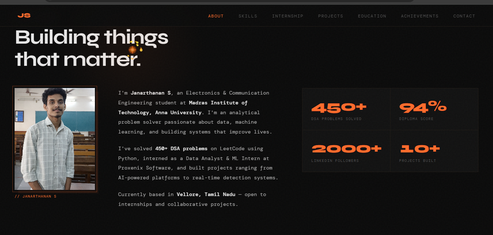

# 👨‍💻 Janarthanan S - Portfolio Website

## 🔗 Live Website
👉 https://janarthananweb.vercel.app/

---

## 📸 Preview

---

## 🚀 About

This is my personal portfolio website developed to showcase my projects, skills, and achievements.  
It highlights my journey as a Python developer and my interest in building real-world applications.

---

## 🛠️ Tech Stack

- HTML5  
- CSS3  
- JavaScript  

---

## 💡 Features

- 📱 Fully responsive design  
- 🎨 Modern UI/UX  
- 📂 Project showcase section  
- 📊 Achievements & coding profiles  
- 📬 Contact section  

---

## 🧠 Achievements

- ✅ Solved 450+ problems on LeetCode  
- 💻 Active on CodeChef  
- 📈 2000+ LinkedIn followers  

---

## 📁 Projects Included

- Smart Hostel Issue Tracking System  
- Movie Reviews Sentiment Analysis (ML)  
- Women Safety Device (Arduino + GPS + GSM)  
- Personal Portfolio Website  

---

## 📬 Contact

- 🔗 LinkedIn: https://www.linkedin.com/in/janarthananmit/  
- 💻 GitHub: https://github.com/Janarthanana057  

---

## ⭐ Show Your Support

If you like this project, give it a ⭐ on GitHub!

---